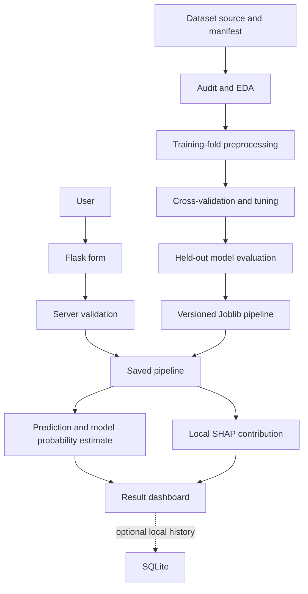

# AI-Based Multi-Disease Prediction and Risk Assessment System

An academic Flask and machine-learning project that compares six classifiers across four public benchmark datasets. The application reports dataset-defined class estimates, measured evaluation metrics, and approximate model-feature contributions.

Prepared as an academic project submission for NIELIT Chennai. This independent research demonstration is not an official NIELIT product or a clinically validated tool.

> **Educational and research demonstration only.** This project is not a medical diagnosis, clinical prediction rule, or substitute for a qualified health professional. Benchmark probabilities are not clinically calibrated personal risks.

## Overview

- Guided, mobile-friendly input forms with plain-language field help, progress feedback, and explicit options for unavailable values.
- Pipeline-based missing-value imputation, categorical encoding, and numeric scaling.
- Five-fold grouped cross-validation and hyperparameter search, with an untouched holdout split for final metrics.
- Logistic Regression, Decision Tree, Random Forest, SVM, KNN, and XGBoost candidates.
- Recall/sensitivity, precision, F1, ROC-AUC, average precision, Brier score, confusion matrix, ROC and precision-recall curves.
- SHAP local feature contributions, labeled as model explanations rather than causes.
- Flask web application, responsive Bootstrap interface, CSRF-protected forms, and JSON prediction endpoint.
- Prediction inputs are not saved by default. Optional SQLite history is intended only for a local instance and must be explicitly enabled.
- Reproducible dataset manifest and generated reports.

## Project structure

See the `src/disease_prediction/`, `scripts/`, `notebooks/`, `models/`, `reports/`, `templates/`, `static/`, and `tests/` folders. Raw datasets and generated artifacts are stored locally and are not silently replaced by fabricated data.

## Architecture



## Dataset sources

| Module | Dataset | Records | Inputs | License/source |
|---|---|---:|---:|---|
| Diabetes | Pima Indians Diabetes Database (`mlbench` copy) | 768 | 8 | CRAN `mlbench` GPL-2 package; original source attribution is recorded in `data/README.md`. |
| Heart | UCI Heart Disease, Cleveland processed subset | 303 | 13 | UCI, CC BY 4.0, DOI 10.24432/C52P4X. |
| Liver | UCI Indian Liver Patient Dataset | 583 | 10 | UCI, CC BY 4.0, DOI 10.24432/C5D02C. |
| Kidney | UCI Chronic Kidney Disease | 400 | 24 | UCI, CC BY 4.0, DOI 10.24432/C5G020. |

Exact missing-value counts, duplicate counts, class distributions, source hashes, and detailed feature definitions are generated into `reports/DATASET_SOURCES.md` and `data/processed/`. The Pima cohort is narrow; the UCI cohorts are small and historical. These limitations restrict generalization.

## Run the app on your computer

The private GitHub repository stores the project files. To open the interactive app locally on Windows:

1. Install Python 3.11 or newer.
2. Open PowerShell in the project folder.
3. Run:

```powershell
py -3 -m venv .venv
.\.venv\Scripts\Activate.ps1
python -m pip install --upgrade pip
python -m pip install -r requirements.txt
python app.py
```

4. Open `http://127.0.0.1:5000` in a browser.
5. Choose a study, enter values from the matching source report, and select “I don't know this value” for anything unavailable. The model pipeline fills those fields from its training data.

The app processes entered values to produce the result but does not save them by default. Do not enter names, contact details, or other identifying information. The output is a historical dataset classification, not a personal medical risk estimate.

## Requirements

- Python 3.11 or newer.
- Internet access to load Bootstrap styling. Model files and dataset snapshots are already included in this project; no training run is needed to start the app.
- A modern browser.

## Model training (Windows PowerShell)

Model training is optional; the selected model pipelines are already included. To train again and regenerate the report tables:

```powershell
.\.venv\Scripts\Activate.ps1
python scripts\train_models.py
python scripts\generate_documentation.py
```

## Deployment

The included `Procfile` starts `wsgi:app` with Gunicorn on a Linux-compatible host. A private GitHub repository stores the code but does not itself run the Flask app. For a later web deployment, install `requirements.txt`, keep the included `models/`, `reports/model_results/`, and `data/processed/` artifacts with the release, set `DISEASE_APP_SECRET_KEY` to a unique secret, and set `DISEASE_APP_COOKIE_SECURE=1` when HTTPS is enforced. Prediction history is off by default. Enabling `DISEASE_APP_STORE_HISTORY=1` saves entered fields and results to SQLite and is intended only for a local, single-user demonstration. Do not enable it on a public deployment without adding private per-user access controls and a retention policy. `FLASK_DEBUG` defaults to off.

## Run the app on macOS/Linux

```bash
cd disease_prediction_ml
python3 -m venv .venv
source .venv/bin/activate
python -m pip install --upgrade pip
python -m pip install -r requirements.txt
python app.py
```

Use Python 3.11 or newer for these commands, then open `http://127.0.0.1:5000`. The acquired dataset snapshots and selected model pipelines are included, so starting the app does not require downloading data or retraining. `requirements-lock.txt` records the exact environment used for the verified run; it is a Windows/Python 3.13 lock and the portable `requirements.txt` contains supported version ranges.

To intentionally refresh source data, run `python scripts/download_data.py`, inspect the updated source hashes and quality report, then retrain and regenerate documentation. Refreshing data may change measured results.

## Training and evaluation

The dataset downloader stores source CSVs and SHA-256 hashes. `data.py` normalizes each target and feature schema. Exact duplicate records are detected and kept together in grouped splits to avoid deleting potentially distinct people with identical measurements or leaking copies across train/test folds. Domain-coded missing Pima measurements are interpreted as missing; kidney and heart missingness is imputed within the training pipeline. Outliers are profiled, not removed automatically.

The 80/20 holdout split is created with grouped stratification and a fixed seed. Hyperparameters are selected using five-fold grouped CV within the training portion. Model selection prioritizes cross-validated recall/sensitivity; F1 and ROC-AUC break ties. The holdout set is used once for reporting, not for tuning. Final pipelines are refit on all available records after holdout evaluation. The saved holdout numbers therefore describe the held-out selection estimate, not an external clinical validation.

All measured values are in `reports/model_results/` and `reports/tables/`. No metric is hardcoded. The application loads the selected pipeline and reports its model version.

## Explainability

SHAP permutation contributions are estimated for a submitted row relative to a small background sample. Summary plots are generated for held-out examples. A feature contribution describes the model output; it does not prove medical causation or clinical importance. If the SHAP computation fails, the application still shows the model estimate and states that the explanation was unavailable.

## Screenshots

The local browser review covered the home, model performance, datasets, history, about, disclaimer, and all four disease forms. Static browser screenshots are not included in this package; if your submission requires them, save screenshots of the running app in `reports/screenshots/`. Interface screenshots are not evidence of clinical validation.

## Results

Run `python scripts/generate_documentation.py` after training and the pytest command above to populate measured result tables and actual test outcomes in this section and the academic report. Results are reported only when generated from actual model execution.

<!-- GENERATED_RESULTS_START -->

Generated from actual holdout evaluation on 2026-09-29:

| Module | Selected model | Accuracy | Precision | Recall / sensitivity | F1 | ROC-AUC | Average precision | Brier |
|---|---|---:|---:|---:|---:|---:|---:|---:|
| Diabetes | Decision Tree | 0.701 | 0.549 | 0.833 | 0.662 | 0.817 | 0.682 | 0.177 |
| Heart disease | Logistic Regression | 0.885 | 0.889 | 0.857 | 0.873 | 0.919 | 0.894 | 0.107 |
| Liver disease | Support Vector Machine | 0.718 | 0.734 | 0.952 | 0.829 | 0.732 | 0.888 | 0.177 |
| Chronic kidney disease | Random Forest | 0.988 | 0.980 | 1.000 | 0.990 | 1.000 | 1.000 | 0.010 |

The metrics are single benchmark holdout estimates; see `reports/PROJECT_REPORT.md` for candidate comparisons, confusion matrices, and limitations.
<!-- GENERATED_RESULTS_END -->

## Limitations

- The datasets are small or population-specific, retrospective benchmark samples.
- Their targets describe source-study labels, not prospective future risk.
- Small held-out estimates have uncertainty and can vary with split choice.
- Model probabilities are uncalibrated and not clinical risk estimates.
- No independent external validation, clinical review, or prospective study is performed.
- Inputs must be sent to the Flask server for prediction, but the app does not persist them by default; do not enter identifying health information.
- Public deployment requires a security and privacy review, authentication, HTTPS, and a documented retention policy.

## Future improvements

- Add external validation on appropriately licensed, representative cohorts.
- Add authenticated, private per-user history only with a documented consent and data-retention design.
- Conduct calibration analysis and predefine threshold trade-offs with domain experts.
- Add model monitoring, subgroup analysis, and a documented retention/access policy.
- Evaluate a general symptom model only if a suitable, independently validated multi-disease dataset is identified.

## License

Project source code is MIT-licensed. Dataset artifacts retain their respective source licenses and attribution; see `data/README.md` and `reports/DATASET_SOURCES.md`.
