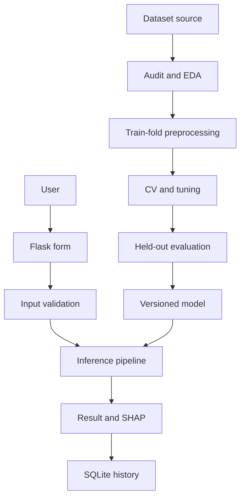
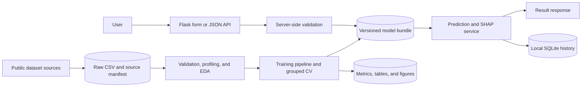
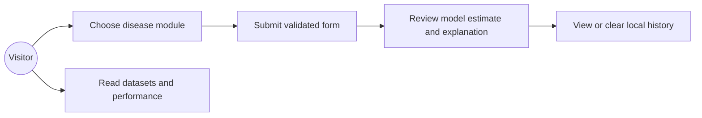
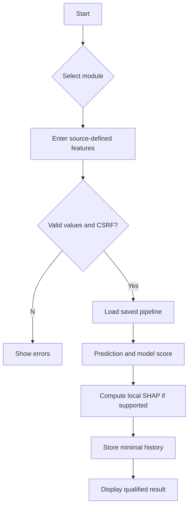

# Project Report: AI-Based Multi-Disease Prediction and Risk Assessment System

**Academic project report · Generated 2026-09-29**

> Educational and research demonstration only. This work does not provide a medical diagnosis or clinical decision support.

## Chapter 1 — Introduction

### 1.1 Background
Supervised machine learning can learn classification patterns from labeled tabular data. Public benchmark datasets allow reproducible demonstrations of data preparation, model comparison, and evaluation, while their historical and population-specific nature limits how results can be interpreted.

### 1.2 Problem statement
Course projects often report one accuracy value without recording data lineage, leakage controls, feature definitions, or error trade-offs. This project builds an auditable web workflow around four dataset-specific binary classification tasks.

### 1.3 Motivation
The motivation is to demonstrate a complete research workflow that can be explained in a viva: public source acquisition, data auditing, preprocessing, model comparison, class-sensitive evaluation, explainability, and web integration.

### 1.4 Objectives
1. Acquire and cite public datasets. 2. Audit missingness, duplicates, types, distributions, and class balance. 3. Compare multiple classifiers using grouped cross-validation. 4. Evaluate selected models on held-out records. 5. expose dataset-specific inputs and qualified outputs through Flask. 6. Add local SQLite history and reproducible documentation.

### 1.5 Scope
Modules cover diabetes, heart disease, liver disease, and chronic kidney disease. Each task uses only the features present in its source. The system is a research demonstration, not a clinical product.

### 1.6 Limitations
The cohorts are small, historical, and not clinically validated for the users of this application. Target labels reflect each source dataset rather than a common prospective disease-risk endpoint.

## Chapter 2 — Literature and Technology Review

### 2.1 Machine learning and supervised learning
Machine learning estimates relationships from data. Supervised learning uses examples paired with labels; this project uses binary classification for the mapped source outcomes.

### 2.2 Classification and candidate algorithms
Logistic Regression provides a regularized linear baseline. Decision Trees model nonlinear rules but can have high variance. Random Forest averages randomized trees. SVM searches for a margin-based decision boundary. KNN classifies by nearby observations and depends on scaling. XGBoost builds an additive sequence of boosted trees. These are candidates, not a ranking of medical usefulness.

### 2.3 Explainable AI and SHAP
SHAP provides additive feature contributions relative to a reference sample for a model output. Here, one-hot contributions are summed back to source variables. The results explain model behavior only; they do not show causation or clinical importance.

## Chapter 3 — System Analysis

### 3.1 Existing approach
Many classroom prototypes use hardcoded predictions, show only accuracy, or omit target provenance. This project instead acquires public source data, generates metrics in code, and saves source hashes and model manifests.

### 3.2 Proposed system
A research pipeline trains versioned scikit-learn pipelines; a Flask application validates inputs and loads those pipelines for inference.

### 3.3 Functional requirements
Home/about pages; four input forms; server validation; model predictions; local explanations; model-performance and dataset pages; history; disclaimer; SQLite persistence; tests.

### 3.4 Non-functional requirements
Reproducibility, readable modules, source attribution, deterministic seed, safe SQL, no hardcoded secrets, input bounds, and explicit limitations.

### 3.5 Hardware and software
Python 3.11+, a standard laptop with enough memory for tabular modeling, a modern browser, Flask, NumPy, pandas, scikit-learn, XGBoost, SHAP, SQLite, Matplotlib, Seaborn, and Plotly.

## Chapter 4 — System Design

### 4.1 System architecture

### 4.2 Data-flow diagram

External data is validated and profiled before training. At inference time, user values are validated, passed through the serialized pipeline, and optionally recorded in local SQLite.

### 4.3 Use cases

### 4.4 Flowchart

### 4.5 Database design
`predictions(id, created_at, disease, input_json, prediction, probability, model_version)`. Values are parameterized; no identity/contact columns are stored. History is local and can be cleared.

### 4.6 Module design
`data.py` loads and normalizes datasets; `preprocessing.py` builds leakage-safe transforms; `training.py` runs EDA/search/evaluation; `prediction.py` loads a saved artifact; `validation.py` checks web input; `database.py` handles SQLite; Flask routes and templates render pages.

## Chapter 5 — Dataset and Preprocessing

See [Dataset sources and measured field audit](DATASET_SOURCES.md) for citations, per-feature definitions, source hashes, class counts, and missingness. The audited raw record counts are 768 diabetes, 303 heart, 583 liver, and 400 kidney. The target and feature counts are generated from downloaded files, not entered by hand.

### 5.1–5.4 Sources, features, and targets
The modules use the Pima Indians Diabetes Database via the CRAN `mlbench` package, UCI Heart Disease (Cleveland processed subset), UCI ILPD, and UCI Chronic Kidney Disease. Each target mapping is implemented in `data.py`; heart is mapped to source `num` 0 versus greater than 0, liver `Selector` 1 versus 2, kidney `ckd` versus `notckd`, and diabetes published binary outcome.

### 5.5 Missing values and data cleaning
The measured missing-value counts are shown in `DATASET_SOURCES.md`. Pima zero-coded measurements are converted to missing according to dataset documentation; legitimate zero pregnancies are preserved. Categorical values are normalized; duplicate rows are counted and kept in the dataset but grouped by feature vector during split creation.

### 5.6–5.8 Feature engineering and split
No new clinical features are invented. Numeric medians, category modes, one-hot encoding, and scaling are fitted within each training fold. Outliers are flagged by the 1.5×IQR rule but not deleted automatically. A fixed-seed grouped stratified 80/20 holdout is used; grouped 5-fold CV and search run only on training records.

## Chapter 6 — Model Development

Six candidates are evaluated per disease: Logistic Regression, Decision Tree, Random Forest, SVM, KNN, and XGBoost. GridSearchCV uses grouped stratified five-fold CV. Selection prioritizes mean CV recall/sensitivity, with F1 then ROC-AUC as tie-breakers. The test set is not used to select a model. The saved pipeline is refit on all available rows only after holdout results are recorded.

## Chapter 7 — Implementation

### 7.1 Backend and frontend
Flask routes serve responsive Bootstrap 5 templates. Server-side schemas check required fields, types, categories, and broad input limits. A session token protects state-changing routes.

### 7.2 Database
SQLite stores a timestamp, disease key, submitted model inputs, prediction, probability estimate, and model version. Parameterized statements are used. Do not enter identifiable health information.

### 7.3 Prediction and explainability
The app loads a Joblib pipeline containing its preprocessing and estimator. Positive-class model estimates are not clinically calibrated. Permutation SHAP runs on transformed numerical features, with encoded categories grouped to the source variable where possible.

## Chapter 8 — Results

### 8.1 EDA results
The generated EDA figures include target and missingness summaries, numeric distributions, box plots, and numeric correlation heatmaps. Observations below are descriptive checks from the measured dataset profile; IQR flags identify values for review and do not establish data errors.

**Diabetes:** 768 records; target counts class 0: 500, class 1: 268. Largest feature missing counts: `Insulin` (374), `SkinThickness` (227). Highest IQR screening counts: `DiabetesPedigreeFunction` (29), `Insulin` (24). Exact duplicate rows detected: 0; duplicates were retained and grouped during splitting.

**Heart disease:** 303 records; target counts class 0: 164, class 1: 139. Largest feature missing counts: `ca` (4), `thal` (2). Highest IQR screening counts: `trestbps` (9), `chol` (5). Exact duplicate rows detected: 0; duplicates were retained and grouped during splitting.

**Liver disease:** 583 records; target counts class 0: 167, class 1: 416. Largest feature missing counts: `ag_ratio` (4). Highest IQR screening counts: `total_bilirubin` (84), `direct_bilirubin` (81). Exact duplicate rows detected: 13; duplicates were retained and grouped during splitting.

**Chronic kidney disease:** 400 records; target counts class 0: 150, class 1: 250. Largest feature missing counts: `rbc` (152), `rc` (131). Highest IQR screening counts: `sc` (51), `bu` (38). Exact duplicate rows detected: 0; duplicates were retained and grouped during splitting.

### 8.2 Model results
All values below were generated from this run. Recall and precision show the sensitivity/false-alarm trade-off; scores are benchmark estimates only.

| Module | Selected model | Accuracy | Precision | Recall / sensitivity | F1 | ROC-AUC | Average precision | Brier |
|---|---|---:|---:|---:|---:|---:|---:|---:|
| Diabetes | Decision Tree | 0.701 | 0.549 | 0.833 | 0.662 | 0.817 | 0.682 | 0.177 |
| Heart disease | Logistic Regression | 0.885 | 0.889 | 0.857 | 0.873 | 0.919 | 0.894 | 0.107 |
| Liver disease | Support Vector Machine | 0.718 | 0.734 | 0.952 | 0.829 | 0.732 | 0.888 | 0.177 |
| Chronic kidney disease | Random Forest | 0.988 | 0.980 | 1.000 | 0.990 | 1.000 | 1.000 | 0.010 |

### 8.3 Candidate comparison

#### Diabetes

| Model | CV recall | CV precision | CV F1 | CV ROC-AUC | Test accuracy | Test precision | Test recall | Test F1 | Test ROC-AUC |
|---|---:|---:|---:|---:|---:|---:|---:|---:|---:|
| Decision Tree | 0.776 | 0.576 | 0.649 | 0.794 | 0.701 | 0.549 | 0.833 | 0.662 | 0.817 |
| XGBoost | 0.771 | 0.615 | 0.682 | 0.839 | 0.734 | 0.594 | 0.759 | 0.667 | 0.842 |
| Logistic Regression | 0.706 | 0.617 | 0.657 | 0.823 | 0.773 | 0.651 | 0.759 | 0.701 | 0.866 |
| Random Forest | 0.697 | 0.652 | 0.672 | 0.830 | 0.779 | 0.656 | 0.778 | 0.712 | 0.850 |
| K-Nearest Neighbors | 0.594 | 0.655 | 0.622 | 0.790 | 0.727 | 0.607 | 0.630 | 0.618 | 0.781 |
| Support Vector Machine | 0.561 | 0.670 | 0.607 | 0.826 | 0.734 | 0.633 | 0.574 | 0.602 | 0.837 |

Selected: **Decision Tree**. Confusion matrix (true rows 0/1, predicted columns 0/1): `[[63, 37], [9, 45]]`. Held-out records: 154. SHAP summary status: generated.

Figures: `reports/figures/diabetes/target_and_missingness.png`, `numeric_distributions.png`, `numeric_boxplots.png`, `correlation_heatmap.png`, `model_comparison.png`, `confusion_matrix.png`, `roc_and_precision_recall.png`, `shap_summary.png`.

#### Heart disease

| Model | CV recall | CV precision | CV F1 | CV ROC-AUC | Test accuracy | Test precision | Test recall | Test F1 | Test ROC-AUC |
|---|---:|---:|---:|---:|---:|---:|---:|---:|---:|
| Logistic Regression | 0.811 | 0.820 | 0.814 | 0.913 | 0.885 | 0.889 | 0.857 | 0.873 | 0.919 |
| XGBoost | 0.802 | 0.834 | 0.817 | 0.908 | 0.836 | 0.821 | 0.821 | 0.821 | 0.902 |
| Support Vector Machine | 0.802 | 0.820 | 0.810 | 0.905 | 0.852 | 0.852 | 0.821 | 0.836 | 0.896 |
| Random Forest | 0.784 | 0.832 | 0.806 | 0.905 | 0.869 | 0.857 | 0.857 | 0.857 | 0.905 |
| K-Nearest Neighbors | 0.747 | 0.862 | 0.800 | 0.870 | 0.902 | 0.893 | 0.893 | 0.893 | 0.924 |
| Decision Tree | 0.738 | 0.750 | 0.743 | 0.824 | 0.721 | 0.720 | 0.643 | 0.679 | 0.801 |

Selected: **Logistic Regression**. Confusion matrix (true rows 0/1, predicted columns 0/1): `[[30, 3], [4, 24]]`. Held-out records: 61. SHAP summary status: generated.

Figures: `reports/figures/heart/target_and_missingness.png`, `numeric_distributions.png`, `numeric_boxplots.png`, `correlation_heatmap.png`, `model_comparison.png`, `confusion_matrix.png`, `roc_and_precision_recall.png`, `shap_summary.png`.

#### Liver disease

| Model | CV recall | CV precision | CV F1 | CV ROC-AUC | Test accuracy | Test precision | Test recall | Test F1 | Test ROC-AUC |
|---|---:|---:|---:|---:|---:|---:|---:|---:|---:|
| Support Vector Machine | 0.943 | 0.733 | 0.825 | 0.732 | 0.718 | 0.734 | 0.952 | 0.829 | 0.732 |
| K-Nearest Neighbors | 0.856 | 0.750 | 0.799 | 0.673 | 0.658 | 0.720 | 0.857 | 0.783 | 0.634 |
| Random Forest | 0.853 | 0.745 | 0.795 | 0.733 | 0.675 | 0.745 | 0.833 | 0.787 | 0.648 |
| Decision Tree | 0.768 | 0.773 | 0.770 | 0.604 | 0.581 | 0.733 | 0.655 | 0.692 | 0.511 |
| XGBoost | 0.675 | 0.813 | 0.733 | 0.715 | 0.607 | 0.764 | 0.655 | 0.705 | 0.646 |
| Logistic Regression | 0.572 | 0.879 | 0.690 | 0.755 | 0.573 | 0.840 | 0.500 | 0.627 | 0.692 |

Selected: **Support Vector Machine**. Confusion matrix (true rows 0/1, predicted columns 0/1): `[[4, 29], [4, 80]]`. Held-out records: 117. SHAP summary status: generated.

Figures: `reports/figures/liver/target_and_missingness.png`, `numeric_distributions.png`, `numeric_boxplots.png`, `correlation_heatmap.png`, `model_comparison.png`, `confusion_matrix.png`, `roc_and_precision_recall.png`, `shap_summary.png`.

#### Chronic kidney disease

| Model | CV recall | CV precision | CV F1 | CV ROC-AUC | Test accuracy | Test precision | Test recall | Test F1 | Test ROC-AUC |
|---|---:|---:|---:|---:|---:|---:|---:|---:|---:|
| Random Forest | 0.995 | 0.995 | 0.995 | 1.000 | 0.988 | 0.980 | 1.000 | 0.990 | 1.000 |
| XGBoost | 0.995 | 0.990 | 0.993 | 1.000 | 0.963 | 0.980 | 0.960 | 0.970 | 0.999 |
| Support Vector Machine | 0.990 | 1.000 | 0.995 | 1.000 | 0.988 | 1.000 | 0.980 | 0.990 | 1.000 |
| Logistic Regression | 0.990 | 1.000 | 0.995 | 0.999 | 0.988 | 1.000 | 0.980 | 0.990 | 1.000 |
| Decision Tree | 0.970 | 0.970 | 0.970 | 0.963 | 0.938 | 0.941 | 0.960 | 0.950 | 0.947 |
| K-Nearest Neighbors | 0.920 | 1.000 | 0.958 | 0.991 | 0.925 | 1.000 | 0.880 | 0.936 | 0.987 |

Selected: **Random Forest**. Confusion matrix (true rows 0/1, predicted columns 0/1): `[[29, 1], [0, 50]]`. Held-out records: 80. SHAP summary status: generated.

Figures: `reports/figures/kidney/target_and_missingness.png`, `numeric_distributions.png`, `numeric_boxplots.png`, `correlation_heatmap.png`, `model_comparison.png`, `confusion_matrix.png`, `roc_and_precision_recall.png`, `shap_summary.png`.

### 8.4 Confusion matrices

Each selected model's confusion matrix is reported with its candidate table above. All-candidate held-out confusion matrices are saved in `reports/figures/<module>/all_model_confusion_matrices.png`. Counts use true rows 0/1 and predicted columns 0/1.

### 8.5 ROC and precision-recall curves

Held-out curves for each candidate are saved in `reports/figures/<module>/all_model_roc_precision_recall.png`. Thresholds use each estimator's default decision rule and are not clinical operating points.

### 8.6 Feature importance and SHAP analysis

Mean absolute grouped SHAP contributions are saved as `reports/tables/<module>_shap_feature_summary.csv` and `reports/figures/<module>/shap_summary.png`. Contributions describe model behavior relative to a reference sample; they are neither causal evidence nor medical advice.

### 8.7 Application screenshots

The local browser review covered the home, model performance, dataset, history, about, disclaimer, and all four disease-form pages. Static browser screenshots are not included in this package; submission-specific images may be saved in `reports/screenshots/` if required.

## Chapter 9 — Testing

Automated test outcome: **32 passed, 0 failed across 32 test cases.**. The suite checks schema-to-dataset agreement, input validation, model loading/inference, SQLite persistence, page responses, forms, and CSRF behavior. It does not replace an independent security assessment or external clinical validation.

| Test ID | Test case | Input | Expected result | Actual result | Status |
|---|---|---|---|---|---|
| T01 | Dataset fields match each form | Actual downloaded dataset schema | Exact input field order matches model schema | Passed | PASS |
| T02 | Input validation accepts sourced example rows | Public-source row with missing fields filled for the fixture | Valid values returned as a one-row frame | Passed | PASS |
| T03 | Missing required input | Omit one required field | Validation error returned | Passed | PASS |
| T04 | Invalid numeric and range input | Text in numeric field / out-of-range value | Validation error returned | Passed | PASS |
| T05 | Unknown field is rejected | Unexpected field in heart module | Validation error returned | Passed | PASS |
| T06 | Database write, list, and clear | Parameter-bound record | Record reads back and deletes cleanly | Passed | PASS |
| T07 | Model bundle load and prediction | Sourced diabetes row | Binary prediction and bounded score returned | Passed | PASS |
| T08 | All saved model bundles load | One sourced row per disease | All four pipelines predict | Passed | PASS |
| T09 | Application page routes | GET on home, about, history, etc. | HTTP 200 | Passed | PASS |
| T10 | Input forms load | GET each disease form | HTTP 200 with module title | Passed | PASS |
| T11 | CSRF check | POST without valid token | HTTP 400 | Passed | PASS |
| T12 | JSON validation route | Incomplete JSON with valid session token | HTTP 400 with field errors | Passed | PASS |
| T13 | Invalid form submission | Incomplete diabetes form with valid CSRF token | HTTP 400 with required-field message | Passed | PASS |
| T14 | Prediction route and history integration | Valid sourced diabetes row with CSRF token | Prediction page renders and history records model version | Passed | PASS |
| T15 | Static favicon asset | GET /static/favicon.svg | HTTP 200 with SVG content | Passed | PASS |

Manual interface review: the local browser rendered the home, performance, dataset, history, about, disclaimer, and four disease-form pages. Static browser screenshots are not included in this package; capture submission-specific images into `reports/screenshots/` if your institution requires them. This page review does not establish accessibility certification.

## Chapter 10 — Limitations and Future Scope

The Pima cohort has a narrow demographic scope. The heart, liver, and kidney datasets are small and historical. Missingness may not be random; repeated rows are handled as groups but patient identifiers are unavailable. Class prevalence, measurement practice, and target definitions differ. False positives, false negatives, bias, population shift, probability calibration, privacy, and clinical utility require further evaluation. Future work should add representative external data, independent validation, calibration and threshold review, subgroup analysis, monitoring, and formal privacy/security governance.

## Chapter 11 — Conclusion

The project implements four public-dataset binary classification modules with actual preprocessing, six candidate estimators per module, grouped cross-validation, hyperparameter search, held-out evaluation, Joblib pipelines, SHAP contribution analysis where supported, a Flask interface, and local SQLite history. The reported metrics describe only the documented benchmark splits. They do not establish medical diagnosis, prospective risk prediction, or clinical effectiveness.
